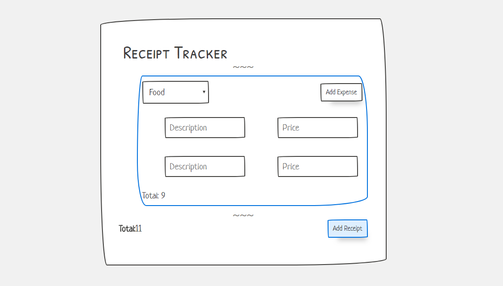

This a simple Receipt Tracker app in ReactJS

It's still not completed yet. I'd really appreciate if you can contibute some help.
As I'm just a beginner in react. 
And sorry if the code is a bit messed up.

These are the current Targets:

- Add new unique expense component inside receipt from 'Add expense' button
- Make the Totaling functional and Real-time
- Fix the design (Me)

